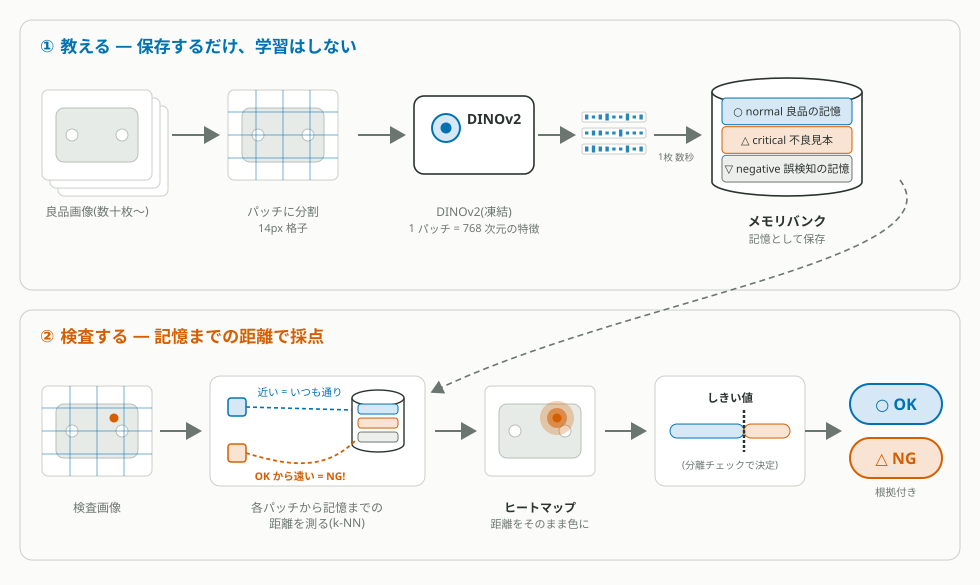

<div align="center">

# Cls-Studio

**見本を見せるだけ。OK か NG かを判定します。**


Cls-Studio は、手元のマシンだけで完結するオープンソースの外観検査・良否判定スタジオです — クラウドアカウント不要、画像送信なし、学習パイプラインなし。

Cls-Studio はニューラルネットワークを学習させる代わりに、熟練検査員と同じやり方で働きます: **良品の見た目を記憶し、「いつもと違う」に気づく**。技術的には、その記憶は凍結された DINOv2 パッチ特徴のメモリバンクであり、検査画像は**最も近い正常の記憶までの距離**で採点されます。良品数十枚から開始でき、不良サンプルはゼロで構いません。誤判定は 1 枚教えるだけ — 数秒で反映され、何も再学習されず、何も劣化しません。

[クイックスタート](#クイックスタート) | [しくみ](#しくみ) | [FAQ](#faq) | [English](README.md)


</div>

---

## どんな検査に向いているか

Cls-Studio は、学習型 AI が苦手とする検査領域のために作られています:

- **不良が多様・希少・予測不能** — 2 回しか見たことのない不良のサンプルを 1,000 枚集めることはできません。
- **多品種少量のライン** — データセット構築より速く新製品がやってくる現場でも、Cls-Studio は良品画像だけで**その日のうちに**検査を始められます。
- **今すぐ立ち上げたいライン** — 教示は学習ではなく保存なので、最初の実用的なしきい値まで数週間ではなく数分です。
- **現場を回すのはデータサイエンティストではなく検査員** — 修正はデータセット整備ではなくドラッグ&ドロップ。間違いに気づいた人がその場で直せます。
- **ラインカメラ・産業カメラ** — TIFF 入力をネイティブに採点します。

不良の種類が確定していてサンプルが豊富な検査には、学習型が適する場合もあります — その領域は兄弟プロジェクト [seg-studio](#関連プロジェクト) の担当です。両方を併用するラインも多い構成です。

## なぜ学習ではなく記憶なのか

| | 学習型の検査AI | **Cls-Studio** |
|---|---|---|
| 開始に必要なデータ | 数百〜数千枚のラベル付き画像(多くは不良品も) | **良品画像 数十枚** |
| 不良サンプル | 事前にほぼ必須 | 任意(後から見本として追加) |
| 立ち上げ時間 | データ整備+学習で日単位 | **数分**(学習ではなく保存) |
| 未知の不良 | 教えていない種類は見逃しやすい | **正常から遠いものすべて**を検出対象にできる |
| 誤判定の修正 | データ収集 → 再学習 → 再検証 | **1 枚教えて数秒で反映**、追記のみ |
| 劣化リスク | 再学習で以前の性能が崩れることがある | なし: 既存の記憶は一切変更されない |
| 判定の根拠 | 説明が難しいことが多い | 距離スコア+ヒートマップ+不良見本への近さの内訳 |
| 更新に必要な計算資源 | GPU での学習実行 | 不要 — 更新はデータベースへの追記 |

また、異常検知の*ライブラリ*と比べると、Cls-Studio はツールキットではなく**完成したスタジオ**です。UI、教示ループ、根拠付きのしきい値決定、オペレーター画面、永続化、パッケージングまで全部入り — 画像から検査運用まで、Python を 1 行も書く必要がありません。

---

## 主な機能

**バンク (Bank) — 取り込みは 1 回、ラベルは何度でも**
- 番号付きの 3 ステップ: 画像を入れる → 1 枚ずつ判断する → 判断をバンクに反映する。終わると ✓ が付き、ラベルを変えると組み立ての ✓ は自動的に外れます
- エンコーダを通すのは**1 枚につき 1 回**(取り込み時)だけ。ラベルを付け直しても同じ特徴を使い回すので、考えを変えるコストはゼロです
- PNG / JPEG / WebP / BMP / GIF / TIFF 対応
- **3 層メモリバンク**: *normal*(良品の記憶)/ *critical*(「傷」「焦げ」など種類別の不良見本)/ *negative*(異常に見えるが許容されるパターン)
- 不良画像への矩形マークで、見本に使う欠陥パッチを正確に指定 — α 項は NG 画像の 99% を占める正常表面ではなく*欠陥そのもの*に反応します
- 画像毎のパッチ上限(コアセット縮約)とバンク容量プラン(小/中/大)でメモリを制御・予測可能に
- 画像単位の削除はその画像の行だけを正確に除去。サムネイルは可逆保存で、再教示は元とビット同一
- クラッシュセーフな永続化: 全書き込みがアトミック、バッチ教示はグループ毎に保存

**学習 (Teach) — 根拠を持ってしきい値を決める**
- 分離度評価: バンク内の全画像を、自分自身を除外した上でバンクに対して採点し、OK / NG のスコア分布を並べて表示
- 1 枚ではなくロットごと除外も可能 — ファイル名の日時・接頭辞、または自分で付けたグループ名で。同一ロットの双子画像が精度を甘く見せるのを防ぎます
- スイープ後の k(近傍数)と α(見本の重み)の自動調整。手動調整は上書きされません
- 分布を根拠にしたしきい値提案 — 勘ではなく、説明できる数字です
- 判定レシピ(メトリック / k / α / しきい値)をバンク毎に保存。以後バンクが変わると「要再確認」を表示
- 特徴空間の射影マップ(PCA / コントラスト)— 外れ値やラベル間違いがひと目で見つかります
- 結果はキャッシュされリロード後も復元。バンクや圧縮設定が変わればキャッシュは自動で無効化

**検査する (Inspect) — ラインを回す**
- 複数枚キュー: 進捗・キャンセル・OK/NG 集計付き
- しきい値を基準にした**絶対スケール**のダイバージングヒートマップ — どの画像でも同じ色は同じスコア
- ラベル別アトリビューション: 「*傷* にどれだけ似ているか」
- 検査ログをサーバー側に永続化(既定でプロジェクト毎 200 件)。リロード後も復元、個別削除可
- 画像毎の処理時間表示(サーバー処理+往復)
- タブ間で統一されたビューア操作: ホイールズーム、ドラッグ / Space+ドラッグでパン、ダブルクリックでフィット、↑/↓ で移動、`H` でヒートマップ切替

**運用する (Operate) — 本番で健全に保つ**
- **バンク圧縮が標準で有効**: int8 量子化 + IVF クラスタルーティング — 常駐メモリ半減、バンクが育っても検索時間はほぼ一定([ベンチマーク](BENCHMARKS.md))。検証したプロジェクトでは判定に影響しませんでした。設定で切替可能、ディスク上のデータは常にフル精度
- 時間認識の見本重み付け(重症度 × 鮮度)、ヒット追跡、ドライラン付き減衰メンテナンス
- バンクの単一ファイル書き出し/読み込み(`.clsbank.zip`)— 判定レシピ同梱で、別マシンでも同一の検査
- 複数プロジェクト、プロジェクト毎の複数名前付きバンク(品種毎に 1 つ)
- マルチクライアント安全: 書き込みは意図したバンクに束縛され、ズレた場合は誤った場所に着地せず明快な 409 で失敗します
- 日英バイリンガル UI、色覚多様性に配慮した配色設計
- ローカルファースト: LAN 公開はオプトイン+共有シークレット認証(`X-API-Token` ヘッダー、任意)
- OpenAPI ドキュメント付き REST API — UI でできることはすべてスクリプト化できます


---

## クイックスタート

### 1. コードを入手 — git は不要です

[Releases ページ](https://github.com/segmen-pixel/cls-studio/releases)から最新の **Source code (zip)** をダウンロードして(リポジトリページの緑の **Code → Download ZIP** ボタンでも可)、好きな場所に展開してください。git 派の方は:
`git clone https://github.com/segmen-pixel/cls-studio.git`

### 2. インストールして起動

**Windows:**
```bash
install-windows.bat
start-windows.bat
```

ターミナルは不要です: 展開したフォルダ直下の `install-windows.bat` をダブルクリックし、続けて `start-windows.bat` をダブルクリックするだけ。インストーラーは GPU を自動判定し(`cpu` / `cuda124` 引数で上書き可)、Python 3.10+ が無い場合は手順を案内します。起動スクリプトはサーバー準備完了後にブラウザで UI を開きます。

**macOS (Apple Silicon / Intel):**
```bash
bash install-macos.sh
bash start-macos.sh
```

ブラウザで **http://localhost:8791/ui/** を開いてください。
停止は `stop-windows.bat` / `bash stop-macos.sh` です。

> git は一切不要です — すべての依存は PyPI の wheel からインストールされます。
> CPU のみでも動作します。大きなバンクには NVIDIA GPU を推奨します。

**Docker (docker compose):**
```bash
docker compose up --build
```

**http://localhost:5173/** を開いてください — UI コンテナが API への呼び出しを中継します。ポートはすべて `127.0.0.1` のみに公開されます。

最初のセッションは 5 ステップです: プロジェクト作成 → **バンク**で良品を数十枚インポートしてラベル付け・組み立て → **学習**でスイープを実行し提案しきい値を保存 → **検査**に画像をドロップ → 間違いがあれば数秒で直す。[ハンドブック](docs/ja/handbook.md)がこの通りに案内します。

---

## ワークフロー

```
プロジェクト --> バンク --> 学習 --> 検査 --> 直し続ける
     |            |          |         |            |
  ライン毎に   取り込み、  分離度評価  スコア+ヒート  誤判定は
  プロジェクト  ラベル、   でしきい値  マップ+根拠、  1枚入れて
  を作成       組み立て   を決める    ログは永続化   数秒で反映
              (NGは
               あれば)
```

---

## しくみ

処理の全体像です — 上段が「学習」(保存のみ・再学習なし)、下段が「検査する」:

<p align="center">
  
</p>

ポイントは 1 つだけです: **画像 1 枚を 1 本のベクトルにするのではなく、パッチ(小区画)単位で 768 次元の特徴にして、パッチ毎に「正常の記憶までの距離」を測る** — だから「どこが異常か」がヒートマップとして描けます。

3 ステップで言い直すと:

1. **見る** — 事前学習済みで凍結された視覚基盤モデル(DINOv2)が、画像をパッチ毎の特徴ベクトルに変換します。その「ものの見方」は膨大な一般画像から学習済みで、あなたのデータで追加学習することはありません — だからこそ、必要なデータが少なくて済みます。
2. **記憶する** — 教えた良品画像の特徴を normal バンクに追記します。教示は学習ではなく保存です: 1 枚数秒、GPU 学習なし、既に動いているものを壊すリスクなし。
3. **比べる** — 検査時は各パッチについて「最も近い良品特徴への top-k 平均距離」を計算します。どの記憶からも遠い=見たことがない=異常の疑い。その距離場がヒートマップです。

パッチのスコアの全体像:

```
スコア = 正常の記憶までの距離            (top-k 平均)
       + α ÷ 不良見本までの距離          (critical 層 — 任意)
       − β ÷ negative の記憶までの距離   (過検知抑制 — 任意)
```

| 層 | 保持するもの | スコアへの効果 |
|---|---|---|
| ○ **normal** | 良品の見た目の多様体 | 距離の土台: 遠い=怪しい |
| △ **critical** | ラベル別のマーク済み欠陥パッチ | 既知の不良の近くでスコアを**押し上げる**(「あの傷に似ている」) |
| ▽ **negative** | 異常に見えるが許容されるパターン | 既知の無害パターンの近くでスコアを**引き下げる** |

すべての判定が「保存された具体的な証拠への距離」なので、Cls-Studio は検出理由を常に提示できます — どの記憶から遠かったか、どの不良見本に近かったか。画像と判定の間に、中身の見えない end-to-end ネットワークはありません。

**圧縮**(標準で有効): normal バンクは int8 量子化で常駐し、IVF クラスタルーティングで検索されます。常駐メモリは半分になり、バンクが育っても検索時間はほぼ一定です。どちらの変換も検証したプロジェクトすべてで判定に影響せず、設定からいつでも無効化できます — ディスク上のバンクは常にフル精度で保存されています。詳細と再現可能な数値: [BENCHMARKS.md](BENCHMARKS.md)。

> **モデルのライセンスについて:** 特徴抽出に使う DINOv2 の重みは Apache-2.0 で公開されており、お使いのマシンにダウンロードされます。モデル定義のソースコードは実行時に `torch.hub` 経由で取得され、Cls-Studio には同梱されません。

---

## FAQ

**学習しないのに、なぜ精度が出るのですか?**
「見る」部分は既に一流だからです — 膨大な画像で事前学習済みの基盤モデルを使っています。あなたのラインが追加すべき情報は「ここでの正常はどんな見た目か」だけで、それには学習ではなく記憶で足ります。そして精度は思い込みではなくアプリ内で測れます: 分離チェックが、しきい値を決める前に OK と NG のスコアがどれだけ離れているかをそのまま見せてくれます。

**不良サンプルがなくても始められますか?**
はい。normal 層だけで「正常からの距離」による採点ができます。不良見本は実際の NG が出てから追加するアップグレードで、既知の不良タイプへの感度とラベル別アトリビューションが加わります。

**良品のばらつき(ロット差・照明の揺らぎ)は?**
教えてください。normal 層に追加されたばらつきは正常の一部になります。特定の無害パターンがしつこく過検知される場合は、negative 層に 1 枚教えればその近傍の反応が抑えられます。

**バンクは無限に育ちませんか?**
いいえ。画像毎に代表パッチへ縮約する上限があり、容量プランが総量を制限し、標準の圧縮が GPU 保持分を半減します。数十万行のバンクでもミリ秒単位で検索できます([ベンチマーク](BENCHMARKS.md))。

**画像はどこに送られますか?**
どこにも。特徴・サムネイル・ログのすべてが、あなたが管理するローカルディレクトリに保存されます([Deployment](docs/deployment.md) 参照)。ソースコードが公開されているので、これは約束ではなく検証可能な事実です。

**顧客や監査に判定根拠を説明できますか?**
できます: 判定毎のスコア、しきい値の出所(それを決めた分離チェック)、ヒートマップ、最近傍見本のアトリビューション。判定レシピはバンク内容に対してバージョン管理されるので、レシピが現在の記憶より古いことも検出できます。

---

## 設定

デフォルトのままで動作します。環境変数で上書きできます:

| 変数 | デフォルト | 用途 |
|---|---|---|
| `CLS_PROJECTS_DIR` | `~/Documents/ClsStudio/projects` | 全プロジェクト/バンクデータの保存先(リポジトリ外必須) |
| `CLS_DB_PATH` | projects と同じ場所 | メタデータ用 SQLite |
| `CLS_MODELS_DIR` | アプリ管理 | アプリが書き込むレジストリ用ディレクトリ (DINOv2 の重みは torch.hub のキャッシュに入ります。場所は `TORCH_HOME` で決まります) |
| `CLS_TORCH_DEVICE` | `auto` | `auto` / `cpu` / `cuda:N` |
| `CLS_API_TOKEN` | 未設定 | 設定すると全 API 呼び出しに `X-API-Token` ヘッダー必須(未設定時は起動時に警告ログ) |
| `CLS_HOST` | `127.0.0.1` | バインドアドレス。LAN 公開は設定画面からのオプトイン+再起動 |
| `CLS_MAX_PATCHES_PER_IMAGE` | `2048` | 教示時に画像 1 枚から保存する normal パッチの上限(0 = 無制限) |
| `CLS_CAPACITY_SMALL` / `_MEDIUM` / `_LARGE` | 35万 / 140万 / 400万行 | バンク毎に選べる容量プランの上限値 |
| `CLS_INSPECTION_LOG_CAP` | `200` | プロジェクト毎に保持する検査結果の件数 |
| `CLS_MAX_UPLOAD_TOTAL_MB` | `2048` | 複数ファイル一括アップロード(バッチ取り込み)1 リクエストあたりの合計サイズ上限(MB)。ファイル 1 個あたりの上限は 200 MB のまま |
| `CLS_MAX_UPLOAD_FILES` | `1024` | 複数ファイル一括アップロード 1 リクエストあたりのファイル数上限 |

バンク圧縮(int8 / IVF)と LAN 公開はアプリ内の**設定**ダイアログから変更します。localhost の外に公開する前に [SECURITY.md](SECURITY.md) をお読みください。

---

## 動作要件

- **OS:** Windows 10 / 11 (64-bit) または macOS 12+
- **GPU:** 任意。大きなバンクと高速な教示には NVIDIA CUDA を推奨。CPU のみでも小さめのバンクで動作します
- **Python:** 3.10+
- **Node.js:** 18+(UI ビルド時のみ)

---

## プロジェクト構成

```
cls-studio/
  apps/
    api/       # FastAPI バックエンド(プロジェクト、バンク、採点、検査ログ)
    ui/        # React フロントエンド(バンク / 学習 / 検査)+ Playwright e2e
  packages/
    clscore/  # メモリバンクコア: 特徴、3層バンク、採点、圧縮
               # — 純 Python、HTTP 非依存
  scripts/
    windows/   # Windows セットアップ/起動スクリプト
    macos/     # macOS セットアップ/起動スクリプト
```

技術スタック: FastAPI + PyTorch(バックエンド)、React + TypeScript + Vite(フロントエンド)、DINOv2 特徴、SQLite メタデータ、アトミック書き込みのファイルベースバンクストレージ。

---

## 関連プロジェクト

- **seg-studio** — 同じファミリーの兄弟スタジオ。セマンティックセグメンテーションのアノテーションと学習を担当します。seg-studio が既知の不良クラスをモデルに*学習*させるのに対し、Cls-Studio は正常を*記憶*して未知を検出します。両方を併用するラインも多い構成です。

---

## コミュニティ

- **Contributing** — Pull Request 歓迎です。大きな変更は先に issue でご相談ください。[CONTRIBUTING.md](CONTRIBUTING.md) 参照。
- **Discussions** — 質問やアイデアは [GitHub Discussions](https://github.com/segmen-pixel/cls-studio/discussions) へ。
- **Security** — 脆弱性は [GitHub Security Advisories](https://github.com/segmen-pixel/cls-studio/security/advisories) から非公開で報告してください。

## ドキュメント

### はじめに

- 🚀 **[はじめての実行](docs/ja/first-run-manual.md)** — 起動から最初の判定まで約 10 分
- 📘 **[ハンドブック](docs/ja/handbook.md)** — インストール → バンク → 学習 → 検査 の通しガイド
- 📙 [ユーザーガイド](docs/ja/user-guide.md) — 全画面・全操作のリファレンス

### リファレンス

- [機能カタログ](docs/ja/catalog.md) / [デプロイ](docs/ja/deployment.md) / [トラブルシューティング](docs/ja/troubleshooting.md)
- [インポート / エクスポート](docs/ja/import_export.md) / [開発者クイックスタート](docs/ja/dev-quickstart.md) / [ロードマップ](docs/ja/ROADMAP.md)
- [ベンチマーク](BENCHMARKS.md) — 再現可能な検索/圧縮ベンチマーク
- [変更履歴](CHANGELOG.md) / [セキュリティポリシー](SECURITY.md)
- API リファレンス: サーバー起動中に `http://localhost:8791/docs`

---

<div align="center">

Copyright 2026 The Cls-Studio Contributors.
Licensed under the [Apache License 2.0](LICENSE).

サードパーティライセンス: [THIRD_PARTY_NOTICES.md](THIRD_PARTY_NOTICES.md) /
上流の帰属表示: [NOTICE](NOTICE)

</div>

---

## 免責事項

本ソフトウェアおよび参照する事前学習済みモデル(DINOv2)は、[Apache License 2.0](LICENSE) 第 7 条に基づき「現状有姿(AS IS)」で提供されます。作者およびコントリビューターは、検査結果の正確性や、その結果と第三者の権利との関係についていかなる保証も行いません。産業用途・安全性が重要な用途に適用する際の検証は、利用者自身の責任で行ってください。

言及されている商標(PyTorch、NVIDIA、CUDA、DINOv2 等)は各所有者に帰属します。詳細な帰属表示は [THIRD_PARTY_NOTICES.md](THIRD_PARTY_NOTICES.md) を参照してください。
