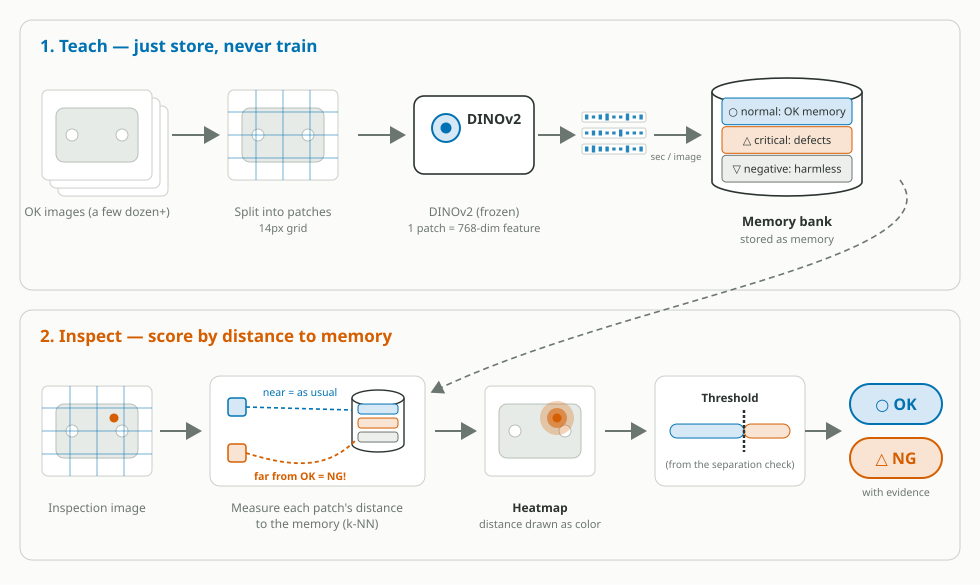

<div align="center">

# Cls-Studio

**Teach it by example. It calls OK or NG.**


Cls-Studio is an open-source visual OK/NG classification studio for factory
inspection that runs entirely on your local machine — no cloud account, no
image upload, no training pipeline.

Instead of training a neural network, Cls-Studio works the way a veteran
inspector does: it **remembers what good parts look like** and notices when
something doesn't match. Technically, that memory is a bank of frozen
DINOv2 patch features, and every inspection image is scored by its
**distance to the nearest remembered normality**. Start from a few dozen OK
images with no defect samples at all, and fix any mistake by teaching a
single image — applied in seconds, nothing retrained, nothing degraded.

[Quick Start](#quick-start) | [How it works](#how-it-works) | [FAQ](#faq) | [Japanese](README.ja.md)


</div>

---

## Where it fits

Cls-Studio is built for the inspection regime where training-based AI
struggles:

- **Defects are diverse, rare, or unpredictable** — you cannot collect a
  thousand samples of a defect you have seen twice.
- **High-mix / low-volume lines** — new products arrive faster than
  datasets can be built; Cls-Studio starts inspecting a new product the same
  day, from OK images alone.
- **Lines that must start now** — teaching is storage, not training, so the
  first usable verdict threshold is minutes away, not weeks.
- **Operators, not data scientists, run the line** — corrections are
  drag-and-drop, not dataset curation; the person who spots the mistake
  fixes it on the spot.
- **Line-scan and industrial cameras** — TIFF input is scored natively.

Training-based methods remain a good fit when defect classes are fixed and
sample-rich — that regime belongs to our sibling project
[seg-studio](#related-projects). Many lines use both.

## Why a memory bank instead of training?

| | Training-based inspection AI | **Cls-Studio** |
|---|---|---|
| Data to start | Hundreds–thousands of labeled images, usually including defects | **A few dozen OK images** |
| Defect samples | Usually required up front | Optional (added later as exemplars) |
| Setup time | Hours–days of dataset work + training | **Minutes** (features are stored, not trained) |
| Unknown defect types | Tends to miss what it was not taught | Flags **anything far from normal** |
| Fixing a mistake | Collect data, retrain, re-validate | **Teach one image — applied in seconds**, append-only |
| Degradation risk | Retraining can forget what worked | None: existing memory is never modified |
| Explaining a verdict | Often difficult | Distance score, heatmap, and nearest-defect-exemplar attribution |
| Compute for updates | GPU training runs | None — updates are database appends |

And compared with anomaly-detection *libraries*: Cls-Studio is a complete
studio, not a toolkit. The UI, the teaching loop, threshold selection with
evidence, operator screens, persistence, and packaging are all built in —
no Python scripting is needed to go from images to a running inspection.

---

## Key features

**Bank — import once, label as often as you like**
- Three numbered steps: import the images, judge them one at a time,
  assemble the bank from those judgements. Each ticks when it is done, and
  assembly unticks itself the moment a label changes
- The encoder runs **once per image** on import; relabelling re-uses the
  stored features, so changing your mind costs nothing
- PNG / JPEG / WebP / BMP / GIF / TIFF accepted
- **3-tier memory bank**: *normal* (the OK manifold), *critical* (defect
  exemplars grouped by kind — "scratch", "stain", ...), *negative*
  (patterns that look anomalous but are acceptable)
- Rectangle marks on defect images pick the exact patches used as
  exemplars — the α term then reacts to *defects*, not to the 99% of an
  NG image that is normal surface
- Per-image patch caps (coreset-reduced) and bank capacity budgets
  (small / medium / large) keep memory bounded and predictable
- Per-image delete prunes exactly that image's rows; thumbnails are stored
  losslessly so a re-teach is bit-identical
- Crash-safe persistence: every write is atomic, batch teaches save
  group-wise

**Teach — pick a threshold you can defend**
- Separation check: every image in the bank scored against it with itself
  held out; OK and NG score distributions drawn side by side
- Hold out a whole lot instead of one image — by the date or prefix in the
  filename, or by a group you name — so near-duplicate frames of the same
  lot cannot flatter the score
- Auto-tuned k (neighbours) and α (exemplar weight) after each sweep;
  manual overrides are respected
- Threshold suggestion with the distributions as evidence — the number is
  defensible, not a gut feeling
- Verdict recipe (metric / k / α / threshold) saved per bank, with
  staleness detection when the bank changes afterwards
- Feature-space projection map (PCA / contrastive) — outliers and
  mislabeled teachings are visible at a glance
- Results are cached and survive reloads; the cache invalidates itself
  when the bank or compression settings change

**Inspect — run the line**
- Multi-image queue with progress, cancel, and an OK / NG tally
- Absolute-scale diverging heatmaps anchored at your threshold — the same
  color means the same score on every image
- Per-label attribution: "how strongly this resembles *scratch*"
- Inspection log persisted server-side (default 200 per project),
  restored after reloads, individually deletable
- Per-image timing readout (server processing + round trip)
- Identical viewer controls across tabs: wheel zoom, drag / Space-drag
  pan, double-click fit, ↑/↓ walk, `H` heatmap toggle

**Operate — keep it healthy in production**
- **Bank compression on by default**: int8 quantisation + IVF cluster
  routing — half the resident memory, near-flat search scaling as banks
  grow ([benchmarks](BENCHMARKS.md)); verdict-neutral on the projects we
  tested, toggleable in Settings, on-disk data always full precision
- Time-aware exemplar weighting (severity × freshness), hit tracking, and
  decay maintenance with dry-run preview
- Bank export / import as a single `.clsbank.zip` — the verdict recipe
  rides along, so a bank moved to another machine inspects identically
- Multiple projects; multiple named banks per project (one per product)
- Multi-client safe: writes are bound to the intended bank and fail with a
  clean 409 instead of landing in the wrong one
- Bilingual UI (Japanese / English); colorblind-safe visual design
- Local-first: LAN access is opt-in, with optional shared-secret auth
  (`X-API-Token` header)
- REST API with OpenAPI docs — everything the UI does is scriptable


---

## Quick Start

### 1. Get the code — no git required

Download the latest **Source code (zip)** from the
[Releases page](https://github.com/segmen-pixel/cls-studio/releases)
(or use the green **Code → Download ZIP** button on the repository page)
and extract it anywhere. If you prefer git:
`git clone https://github.com/segmen-pixel/cls-studio.git`

### 2. Install and start

**Windows:**
```bash
install-windows.bat
start-windows.bat
```

No terminal needed: double-click `install-windows.bat`, then
`start-windows.bat`, right in the extracted folder. The installer
auto-detects your GPU (pass `cpu` or `cuda124` to override) and prints
step-by-step guidance if Python 3.10+ is missing. The start script opens
the UI in your browser once the server is ready.

**macOS (Apple Silicon / Intel):**
```bash
bash install-macos.sh
bash start-macos.sh
```

Then open **http://localhost:8791/ui/** in your browser.
Stop everything later with `stop-windows.bat` / `bash stop-macos.sh`.

> git is never required — every dependency installs from PyPI wheels.
> CPU-only works; an NVIDIA GPU is recommended for large banks.

**Docker (docker compose):**
```bash
docker compose up --build
```

Then open **http://localhost:5173/** — the UI container proxies API calls to
the backend. All ports are published on `127.0.0.1` only.

Your first session, in five steps: create a project → import a few dozen
OK images on **Bank**, label them and assemble → run the sweep on **Teach**
and save the suggested threshold → drop images on **Inspect** → correct any
mistake back in seconds.
The [Handbook](docs/handbook.md) walks through exactly this.

---

## Workflow

```
Projects   -->   Bank    -->   Teach   -->   Inspect   -->   Keep correcting
   |              |             |             |                  |
 Create a     Import,       Separation    Score images,      Correct any
 project      label,        check picks   heatmaps,          mistake with
 per line     assemble      the verdict   attribution,       one image in
              (+ defects    threshold     persisted log      seconds
              if you have
              them)
```

---

## How it works

The whole pipeline at a glance — top: teaching (storage only, no
training), bottom: inspection:

<p align="center">
  
</p>

The one idea that matters: **an image is never collapsed into a single
vector — every patch gets its own 768-dim feature and its own distance to
the remembered normality**, which is exactly why "where is it anomalous"
can be drawn as a heatmap.

The same thing in three steps:

1. **See** — a frozen, pre-trained vision foundation model (DINOv2)
   converts each image into per-patch feature vectors. Its "way of seeing"
   was learned from vast general imagery and is never fine-tuned on your
   data — which is exactly why it needs so little of it.
2. **Remember** — features of taught OK images are appended to the normal
   memory bank. Teaching is storage, not training: seconds per image, no
   GPU training run, no risk to what was already working.
3. **Compare** — at inspection time, every patch is scored by its top-k
   mean distance to the nearest normal features. Far from every memory =
   never seen = suspicious. The heatmap is that distance field.

The full score of a patch is:

```
score = distance to normal memory            (top-k mean)
      + α / distance to defect exemplars     (critical tier — optional)
      − β / distance to negative memory      (false-positive suppression — optional)
```

| Tier | Holds | Effect on the score |
|---|---|---|
| ○ **normal** | The OK manifold — what good parts look like | The base distance: far = suspicious |
| △ **critical** | Marked defect patches, per label | Pulls the score **up** near known defects ("this looks like that scratch") |
| ▽ **negative** | Anomalous-looking but acceptable patterns | Pulls the score **down** near known-harmless patterns |

Because every verdict is a distance to concrete stored evidence, Cls-Studio
can always show *why* it flagged a region — which memory it was far from,
and which defect exemplar it was near. There is no inscrutable
end-to-end network between the image and the verdict.

**Compression** (on by default): the normal bank is held int8-quantised
and searched through IVF cluster routing, halving resident memory and
keeping search time nearly flat as the bank grows. Both transforms were
verdict-neutral on every project we tested, and both can be
switched off in Settings at any time — the on-disk bank is always stored
at full precision. Details and reproducible numbers:
[BENCHMARKS.md](BENCHMARKS.md).

> **Model licensing note:** the DINOv2 weights used for feature extraction
> are published under Apache-2.0 and are downloaded to your machine; the
> model-definition source is fetched at runtime via `torch.hub` and is not
> bundled with Cls-Studio.

---

## FAQ

**It never trains — how can it be accurate?**
The "seeing" part is already world-class: a foundation model pre-trained
on vast imagery. The only thing your line needs to add is *what normal
looks like here*, and memory — not training — is enough for that. Accuracy
on your data is measurable in-app: the separation check shows exactly how
far apart your OK and NG scores are before you commit to a threshold.

**Do I need defect samples to start?**
No. The normal tier alone gives you "distance from normal" scoring. Defect
exemplars are an upgrade you add when real NG images appear — they sharpen
sensitivity to known defect types and enable per-label attribution.

**What about normal variation — lot differences, lighting drift?**
Teach it. Variation added to the normal tier becomes part of normality.
For stubborn false positives from a specific harmless pattern, one
teaching into the negative tier suppresses reactions near it.

**Does the bank grow forever?**
No. Each image is capped to its most representative patches, capacity
budgets bound the total, and default compression halves what the GPU
holds. A six-figure-row bank searches in milliseconds
([benchmarks](BENCHMARKS.md)).

**Where do my images go?**
Nowhere. Everything — features, thumbnails, logs — stays in a local
directory you control (see [Deployment](docs/deployment.md)). The source
is open (Apache-2.0), so this is verifiable, not a promise.

**Can results be explained to a customer / auditor?**
Yes: per-verdict score, threshold provenance (the separation check the
threshold came from), heatmap, and nearest-exemplar attribution. The
verdict recipe is versioned against bank content, so you can tell when a
recipe predates the current memory.

---

## Configuration

Everything runs with defaults; these environment variables override them:

| Variable | Default | Purpose |
|---|---|---|
| `CLS_PROJECTS_DIR` | `~/Documents/ClsStudio/projects` | Root of all project / bank data (must be outside the repo) |
| `CLS_DB_PATH` | alongside projects dir | SQLite metadata database |
| `CLS_MODELS_DIR` | app-managed | Registry directory the app writes into (the DINOv2 download lands in the torch.hub cache, set by `TORCH_HOME`) |
| `CLS_TORCH_DEVICE` | `auto` | `auto` / `cpu` / `cuda:N` |
| `CLS_API_TOKEN` | unset | When set, every API call must carry this shared secret in the `X-API-Token` header (a startup warning is logged when unset) |
| `CLS_HOST` | `127.0.0.1` | Bind address; LAN exposure is opt-in from Settings and requires a restart |
| `CLS_MAX_PATCHES_PER_IMAGE` | `2048` | Per-image cap of normal patches kept at teach time (0 = uncapped) |
| `CLS_CAPACITY_SMALL` / `_MEDIUM` / `_LARGE` | 350k / 1.4M / 4M rows | Bank size budgets selectable per bank |
| `CLS_INSPECTION_LOG_CAP` | `200` | Persisted inspection results kept per project |
| `CLS_MAX_UPLOAD_TOTAL_MB` | `2048` | Total size (MB) accepted per multi-file upload request (batch import); each single file is still capped at 200 MB |
| `CLS_MAX_UPLOAD_FILES` | `1024` | Maximum number of files accepted in one multi-file upload request |

Bank compression (int8 / IVF routing) and LAN access are configured in the
in-app **Settings** dialog. See [SECURITY.md](SECURITY.md) before exposing
Cls-Studio beyond localhost.

---

## Requirements

- **OS:** Windows 10 / 11 (64-bit) or macOS 12+
- **GPU:** optional. NVIDIA CUDA recommended for large banks and fast
  teaching; CPU-only operation works with smaller banks
- **Python:** 3.10+
- **Node.js:** 18+ (UI build only)

---

## Project structure

```
cls-studio/
  apps/
    api/       # FastAPI backend (projects, banks, scoring, inspections)
    ui/        # React frontend (Bank / Teach / Inspect) + Playwright e2e
  packages/
    clscore/  # Memory-bank core: features, 3-tier bank, scoring,
               # compression — pure Python, no HTTP dependency
  scripts/
    windows/   # Windows setup/start scripts
    macos/     # macOS setup/start scripts
```

Stack: FastAPI + PyTorch (backend), React + TypeScript + Vite (frontend),
DINOv2 features, SQLite metadata, file-based bank storage with atomic
writes.

---

## Related projects

- **seg-studio** — a sibling studio from the same family, for semantic
  segmentation annotation and training. Where seg-studio *trains* models
  for known defect classes, Cls-Studio *remembers* normality and flags the
  unknown; many lines use both.

---

## Community

- **Contributing** — Pull requests are welcome. Please open an issue first
  for major changes. See [CONTRIBUTING.md](CONTRIBUTING.md).
- **Discussions** — Use [GitHub Discussions](https://github.com/segmen-pixel/cls-studio/discussions) for questions and ideas.
- **Security** — Report vulnerabilities privately via
  [GitHub Security Advisories](https://github.com/segmen-pixel/cls-studio/security/advisories).

## Documentation

### Getting started

- 🚀 **[First Run Walkthrough](docs/first-run-manual.md)** — server to first verdict in ~10 minutes
- 📘 **[Handbook](docs/handbook.md)** — linear walkthrough: install → teach → check → inspect
- 📗 **[Feature Catalog](docs/catalog.md)** — one-page overview of every feature

### Reference

- [User Guide](docs/user-guide.md) — every screen and control
- [Deployment](docs/deployment.md) — LAN, auth, Docker, backups, env vars
- [Troubleshooting](docs/troubleshooting.md)
- [Import / Export](docs/import_export.md) — bank (`.clsbank.zip`) and whole-project (`.clsproj.zip`) packages
- [Edge export](docs/edge_export.md) — `.clsedge.zip`, for scoring on a device
- [Developer Quickstart](docs/dev-quickstart.md)
- [Roadmap](docs/ROADMAP.md)
- [Benchmarks](BENCHMARKS.md) — reproducible search/compression benchmarks
- [Changelog](CHANGELOG.md) / [Security policy](SECURITY.md)
- API reference: `http://localhost:8791/docs` while the server is running

Japanese guides: [はじめての実行](docs/ja/first-run-manual.md) / [ハンドブック](docs/ja/handbook.md) / [ユーザーガイド](docs/ja/user-guide.md) — every doc above has a Japanese mirror under [docs/ja/](docs/ja/)

---

<div align="center">

Copyright 2026 The Cls-Studio Contributors.
Licensed under the [Apache License 2.0](LICENSE).

Third-party licenses: [THIRD_PARTY_NOTICES.md](THIRD_PARTY_NOTICES.md) /
Upstream attributions: [NOTICE](NOTICE)

</div>

---

## Disclaimer

This software and the referenced pretrained models (DINOv2) are distributed
on an "AS IS" basis under [Apache License 2.0](LICENSE), Section 7. The
authors and contributors make no warranty regarding the accuracy of
inspection results or the relationship of those results to any third-party
rights. Users are responsible for their own validation when applying the
software to industrial or safety-critical workflows.

All trademarks referenced (PyTorch, NVIDIA, CUDA, DINOv2, etc.) are the
property of their respective owners — see
[THIRD_PARTY_NOTICES.md](THIRD_PARTY_NOTICES.md) for the complete
attribution.
