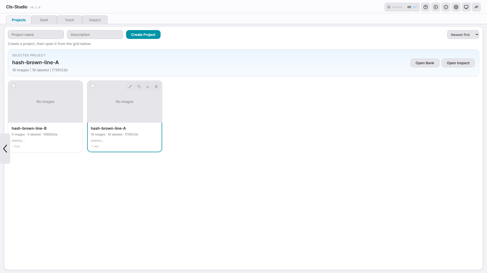
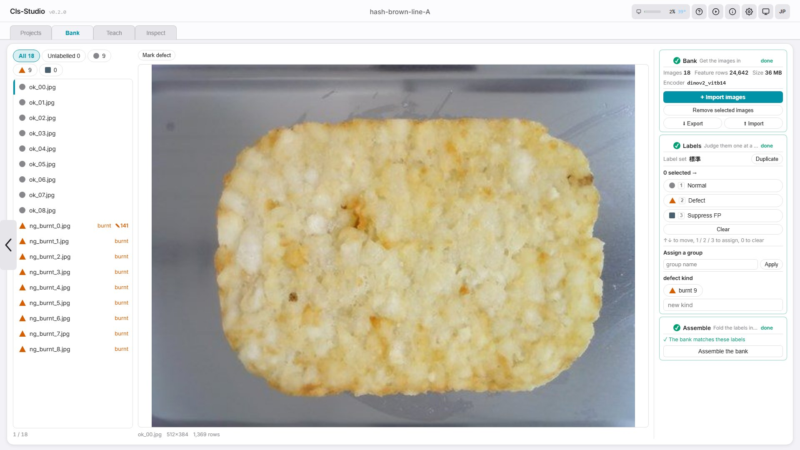
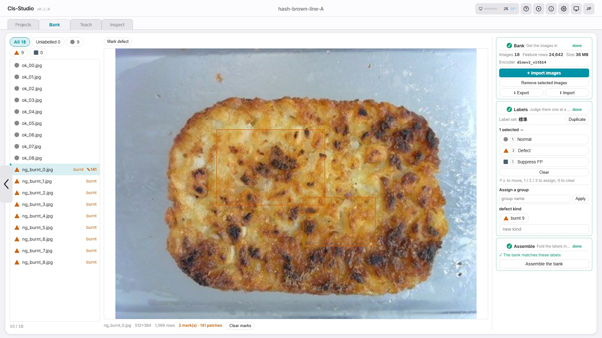
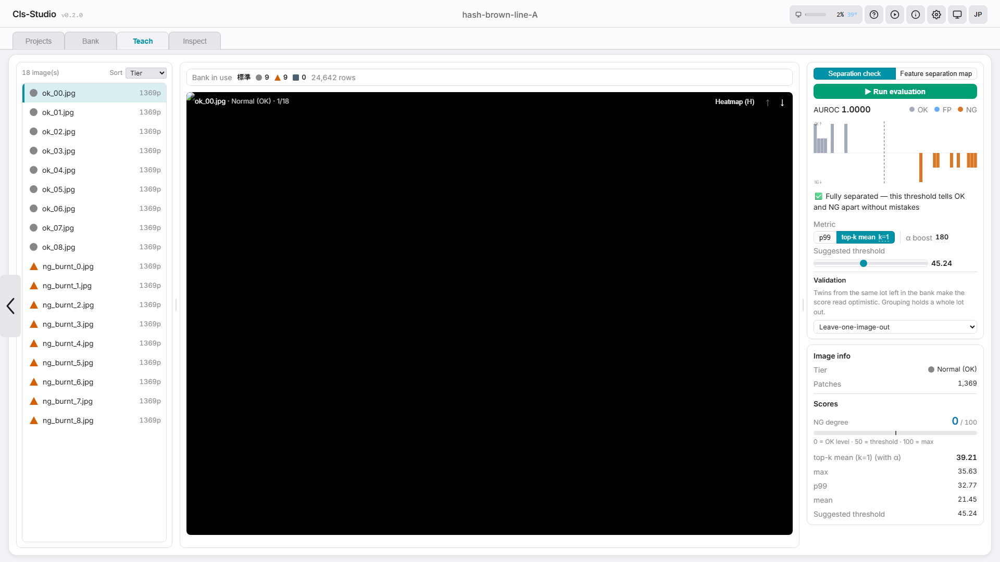
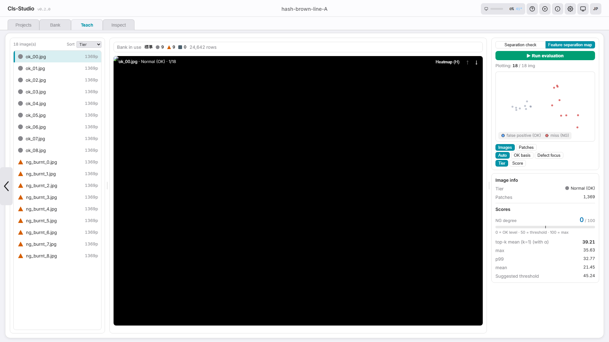
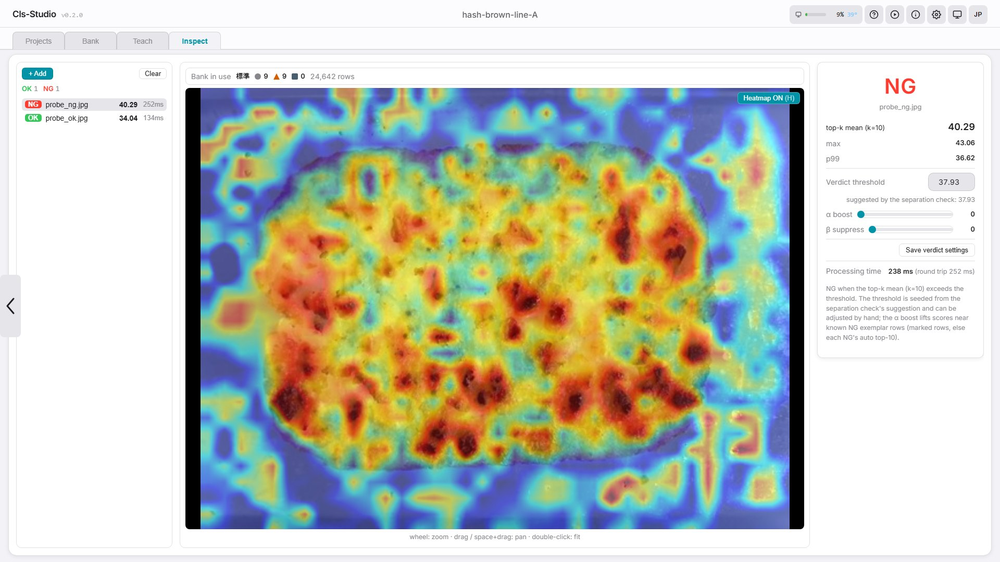

# First Run Walkthrough

> **Which document is this?** The shortest single path — six steps from a
> running server to your first OK / NG verdict. Installing Cls-Studio is
> covered by the [README Quick Start](../README.md#quick-start), individual
> screens by the [User Guide](user-guide.md), and the same workflow with
> more context by the [Handbook](handbook.md).

Welcome to Cls-Studio, a pass/fail classification tool built for factory
inspection. This guide walks you from opening the app to your first
verdict in about 10 minutes. There is **no training step** — Cls-Studio
memorises what "good" looks like and flags what deviates, so showing it a
handful of images is genuinely all there is to it.

No machine learning experience required. Just follow the steps.

> Japanese version: [ja/first-run-manual.md](ja/first-run-manual.md)
>
> **Prerequisite:** Cls-Studio has to be installed and running before
> step 1. If it isn't, install it first — [README → Quick
> Start](../README.md#quick-start) — then come back here.

---

## Before You Start

You need two things:

1. **The Cls-Studio server running** on your machine (or a machine on your
   network). You should be able to reach `http://localhost:8791/ui/` in a
   browser.
2. **10–30 photos of GOOD parts** — the product as it should look, ideally
   covering normal variation (different lots, slight lighting or position
   changes). PNG, JPEG or TIFF all work. Defect photos are optional; you
   can add them later.

> **No parts at hand?** Generate a synthetic demo set and follow along
> with it: `python scripts/make_demo_images.py --out demo_images` writes
> OK plates, NG variants and two probe images.

If someone else set up the server for you, just confirm the URL and move on.

---

## Step 1: Open Cls-Studio (30 seconds)

Open your browser and go to:

```
http://localhost:8791/ui/
```

You should see a header bar with four tabs: **Projects**, **Bank**,
**Teach**, and **Inspect**. They are in working order — you fill the bank,
you check what it can tell apart, then you inspect with it. The Projects
tab is selected by default. The header also has the 日本語 / English
toggle if you prefer Japanese.

> **Tip:** If the page won't load, the server probably isn't running. Ask
> your setup person to check, or look at the terminal where the server was
> started.

## Step 2: Create Your First Project (1 minute)

A project holds the memory banks, images and inspection log for one
inspection task — one per product / camera setup is a good default.

1. Type a name in the text field — something descriptive like
   `Housing Surface Check`.
2. Click **Create Project**.
3. A project card appears and is selected automatically.



## Step 3: Fill the Bank (4 minutes)

Open the **Bank** tab. It is three numbered steps down the right-hand
side, and they finish in order — each one shows a tick when it is done.

**① Bank — get the images in.** Press **+ Import images** and pick your
photos, all at once is fine. Each image goes through the encoder exactly
once and its patches are stored. This is the only slow part, and you never
pay it again: relabelling later re-uses the same features.

**② Labels — judge them one at a time.** Walk the list on the left and
give each image a verdict. Select rows and press `1`, `2` or `3`, or use
the buttons:

- **Normal** — a good part.
- **Defect** — a bad one. Give the defect a kind (`scratch`, `burnt`, …)
  so the bank learns named defects rather than one anonymous heap.
- **Suppress FP** — something that looks alarming but is acceptable.
  Anything near it scores lower.

Labels are free to change. The features do not move, so you can relabel as
often as you like.

**③ Assemble — fold the labels into the bank.** Press **Assemble the
bank**. This is the step that matters: *changing labels alone changes
nothing that inspection sees* until the bank is assembled from them.



> **Coverage beats volume.** Thirty photos spanning your normal variation
> are worth more than three hundred identical ones.

### Marking a defect (optional, 1 minute)

Open a defect image and press **Mark defect**, then drag rectangles over
the defect itself. Those patches become the exemplars the α boost lifts
scores towards — the difference between "this image is bad somewhere" and
"this is a scratch, here".



## Step 4: Check the Separation (2 minutes)

Switch to the **Teach** tab and press **▶ Run evaluation**. Every image in
the bank is scored against it — with its own patches held out — and the
score distributions are drawn.

- **AUROC 1.0000 and "fully separated"** means the threshold tells your OK
  and NG images apart without a mistake. Anything less lists the images
  that overlap, so you can go look at them.
- **Metric / α boost / threshold** are tuned automatically after each
  sweep. Adjust them by hand if you want; your edits are not overwritten.
- **Validation** decides how much is held out. The default
  *Leave-one-image-out* excludes only the image being scored, which reads
  optimistically when near-duplicate frames of the same lot are still in
  the bank. Choose a grouping rule — by the date in the filename or by a
  filename prefix — and the whole lot is held out instead.



The **Feature separation map** beside it draws the bank from above:
every patch as a point, coloured by score. Outliers and mislabelled images
show up here as points sitting with the wrong crowd.



## Step 5: Inspect (1 minute)

1. Switch to the **Inspect** tab.
2. Drop a part photo — a good one, or a defective one if you have it.
3. You get a score, an **OK / NG** verdict against the threshold, and a
   heatmap showing *where* the image deviates from everything in the bank.
   Press `H` to toggle the heatmap, scroll to zoom.
4. Press **Save verdict settings** in the right-hand panel to persist the
   threshold — it survives restarts and rides along in bank exports.



## Step 6: Correct and Repeat (ongoing)

The daily loop that makes Cls-Studio sharper in production:

- **False alarm?** Import that image and label it **Normal**. If one
  harmless pattern keeps triggering, label one example of it **Suppress
  FP** instead — reactions near it are damped.
- **Missed defect?** Import it, label it **Defect** with a kind, open it
  and mark the defect itself.

Either way, press **Assemble the bank** afterwards — that is what puts the
correction in front of the next inspection. Then re-run the separation
check and re-save the threshold.

---

## Where to go next

- [User Guide](user-guide.md) — every screen and control
- [Handbook](handbook.md) — the same journey with reasoning and tips
- [Deployment](deployment.md) — LAN access, tokens, Docker, backups
- [Troubleshooting](troubleshooting.md) — when something looks wrong
