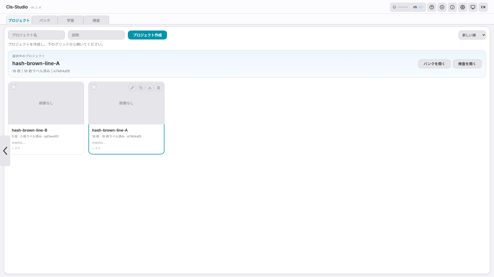
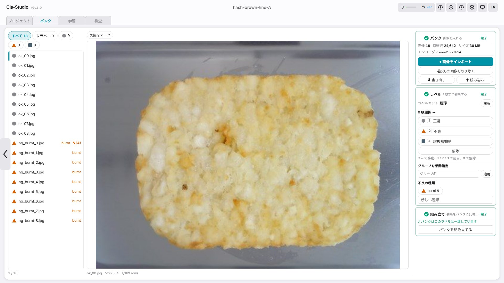
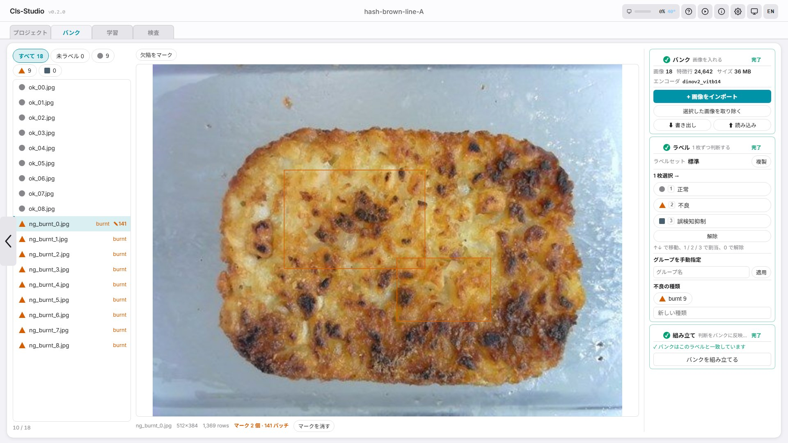
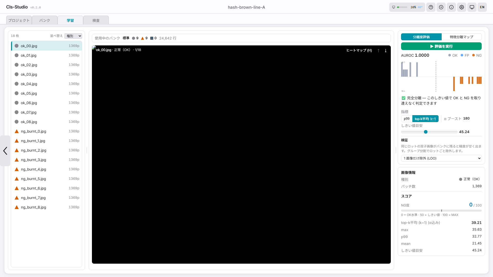
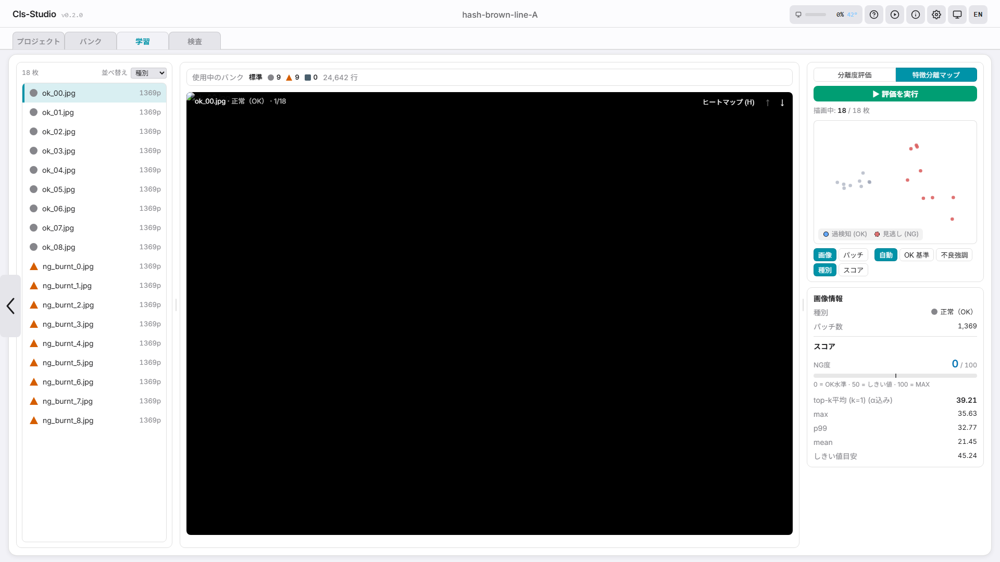
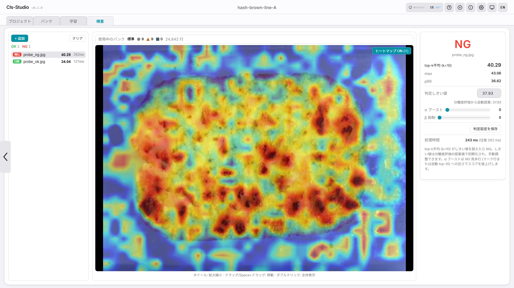

# はじめての実行

> 英語版: [../first-run-manual.md](../first-run-manual.md)

> **このドキュメントの位置づけ:** サーバーが起動した状態から最初の OK / NG 判定までを 6 ステップでたどる、最短の一本道です。Cls-Studio のインストールは [README クイックスタート](../../README.ja.md#クイックスタート)、画面ごとの説明は [ユーザーガイド](user-guide.md)、同じワークフローをより多くの文脈付きで解説するのは [ハンドブック](handbook.md) が担当します。

Cls-Studio へようこそ。工場検査のために作られた良否判定ツールです。このガイドでは、アプリを開いてから最初の判定までを約 10 分でたどります。**AI モデルのトレーニングはありません** — Cls-Studio は見せられた見本を記憶し、それとの距離で OK / NG を判定します。やることは画像を少数見せること — 本当にそれだけです。

機械学習の経験は不要です。手順どおりに進めてください。

> **前提:** ステップ 1 の前に Cls-Studio がインストールされ、起動している必要があります。まだの場合は先にインストールを済ませてから — [README → クイックスタート](../../README.ja.md#クイックスタート) — ここに戻ってきてください。

---

## はじめる前に

必要なものは 2 つです:

1. **Cls-Studio サーバーが起動していること** — 手元のマシン(またはネットワーク上のマシン)で動いていて、ブラウザから `http://localhost:8791/ui/` に到達できる状態です。
2. **良品の写真 10〜30 枚** — 本来あるべき製品の見た目で、正常のばらつき(ロット差、わずかな照明や位置の変化)をカバーしているのが理想です。PNG / JPEG / TIFF のいずれも使えます。欠陥写真は任意で、後から追加できます。

> **手元に部品がない場合** は合成デモセットで進められます: `python scripts/make_demo_images.py --out demo_images` が良品プレート・NG バリアント・検査用プローブ 2 枚を書き出します。

サーバーを他の人がセットアップしてくれた場合は、URL だけ確認して先に進んでください。

---

## ステップ 1: Cls-Studio を開く (30 秒)

ブラウザで次の URL を開きます:

```
http://localhost:8791/ui/
```

ヘッダーバーに **プロジェクト**、**バンク**、**学習**、**検査** の 4 つのタブが表示されるはずです。並び順が作業順です — バンクを作り、何を見分けられるか確かめ、それで検査します。デフォルトではプロジェクトタブが選択されています。ヘッダーには 日本語 / English の切り替えもあります。

> **ヒント:** ページが表示されない場合、サーバーが起動していない可能性が高いです。セットアップした人に確認を頼むか、サーバーを起動したターミナルを見てください。

## ステップ 2: 最初のプロジェクトを作る (1 分)

プロジェクトは、1 つの検査タスクのメモリバンク・画像・検査ログをまとめて保持します — 製品 × カメラ構成ごとに 1 つが目安です。

1. テキスト欄に名前を入力します — `Housing Surface Check` のような内容の分かる名前にします。
2. **プロジェクト作成**をクリックします。
3. プロジェクトカードが現れ、自動的に選択されます。



## ステップ 3: バンクを作る (4 分)

**「バンク」**タブを開きます。右側に番号付きの 3 ステップが縦に並んでいて、順に片付きます — 終わったステップには ✓ が付きます。

**① バンク — 画像を入れる。** **+ 画像をインポート**を押して写真を選びます。一度に全部で構いません。各画像はエンコーダを 1 回だけ通り、そのパッチが保存されます。時間がかかるのはここだけで、二度と払いません — 後からラベルを付け直しても同じ特徴を使い回します。

**② ラベル — 1 枚ずつ判断する。** 左のリストを順に見て、各画像に判定を与えます。行を選んで `1` / `2` / `3` を押すか、ボタンを使います:

- **正常** — 良品。
- **不良** — 不良品。欠陥の種類(`傷`、`焦げ` など)も付けると、バンクが名前の付いた欠陥を覚えます。付けないと「NG」という一塊になります。
- **過検知抑制** — 異常に見えるが許容されるもの。これに近いものはスコアが下がります。

ラベルは何度でも変えられます。特徴は動かないので、付け直しは自由です。

**③ 組み立て — 判断をバンクに反映する。** **バンクを組み立てる**を押します。ここが要点です: *ラベルを変えただけでは検査は変わりません*。組み立てて初めて反映されます。



> **枚数よりカバー範囲。** 正常のばらつきを覆う 30 枚は、同じような 300 枚より価値があります。

### 欠陥をマークする (任意、1 分)

不良画像を開いて **欠陥をマーク**を押し、欠陥部分に矩形をドラッグします。そのパッチが見本になり、α ブーストがスコアを引き寄せる先になります — 「この画像はどこかがおかしい」と「ここに傷がある」の違いです。



## ステップ 4: 分離度を確かめる (2 分)

**「学習」**タブに切り替えて **▶ 評価を実行**を押します。バンク内の全画像が — 自分自身のパッチを除外した上で — バンクに対して採点され、スコア分布が描かれます。

- **AUROC 1.0000 と「完全に分離」** は、そのしきい値が OK と NG を 1 枚も間違えずに分けられる状態です。届かない場合は重なっている画像が一覧されるので、見に行けます。
- **メトリック / α ブースト / しきい値** はスイープ後に自動調整されます。手で動かしても上書きされません。
- **検証**はどこまで除外するかを決めます。既定の *1 画像だけ除外 (LOO)* は採点中の画像だけを外すため、同一ロットの双子画像がバンクに残っていると楽観的に出ます。グループ分割のルール — ファイル名の日時、またはファイル名の接頭辞 — を選ぶと、ロットごと除外されます。



隣の **特徴分離マップ**はバンクを上から見た図です。パッチ 1 つが点 1 つで、スコアで色付けされます。外れ値やラベル間違いは、違う集団に混ざった点として見えます。



## ステップ 5: 検査する (1 分)

1. **「検査」**タブに切り替えます。
2. 部品の写真をドロップします — 良品でも、あれば不良品でも構いません。
3. スコア、しきい値に対する **OK / NG** 判定、そしてバンクの中身から*どこが*外れているかを示すヒートマップが出ます。`H` でヒートマップ切替、スクロールでズームです。
4. 右パネルの**判定設定を保存**でしきい値を永続化します — 再起動後も残り、バンクの書き出しにも同梱されます。



## ステップ 6: 直して繰り返す (継続)

Cls-Studio が現場で鋭くなっていく日々のループです:

- **過検知が出た?** その画像をインポートして**正常**を付けます。特定の無害なパターンが繰り返し引っかかるなら、その 1 例を**過検知抑制**にすると、近傍の反応が抑えられます。
- **不良を見逃した?** インポートして種類付きの**不良**を付け、開いて欠陥そのものをマークします。

どちらの場合も、最後に**バンクを組み立てる**を押してください — それが次の検査に反映させる操作です。その後、分離度評価をやり直してしきい値を保存し直します。

---

## 次に読むもの

- [ユーザーガイド](user-guide.md) — 画面と操作のすべて
- [ハンドブック](handbook.md) — 同じ道のりを、理由と勘所つきで
- [デプロイ](deployment.md) — LAN 公開、トークン、Docker、バックアップ
- [トラブルシューティング](troubleshooting.md) — 様子がおかしいとき
